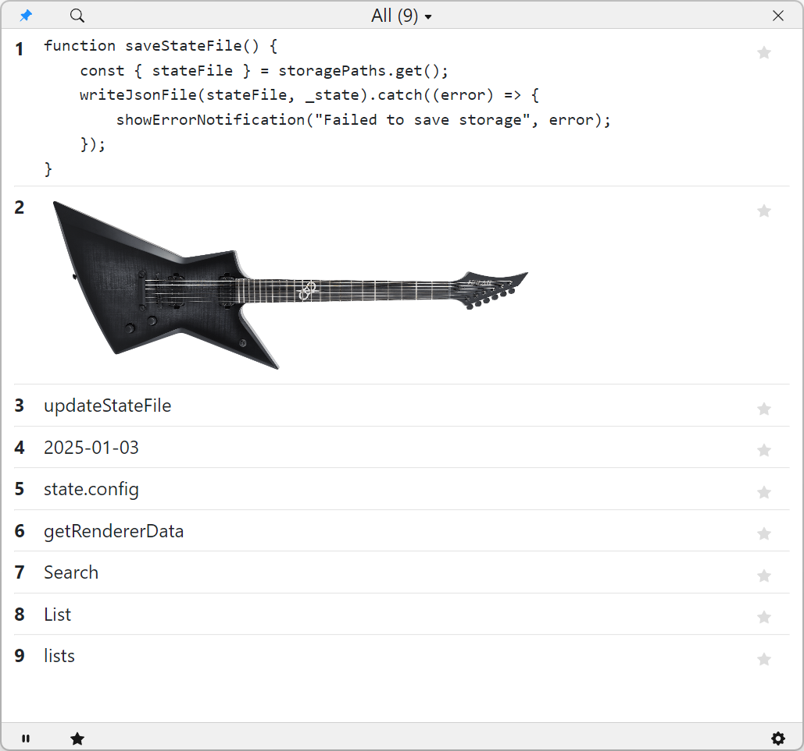

# Clippy

Clipboard manager with RPC. Support keyboard, mouse and excellent Talon Voice integration.

## Releases

Latest prepackaged releases available at [GitHub](https://github.com/AndreasArvidsson/clippy/releases)

### MacOS

On MacOS applications not downloaded from the app store gets tagged with a quarantine attribute. When you try to run the file you get a message that the file is damaged and can't be opened. Mac users needs to compile the source code themself for now.

## Talon user scripts

If you are going to use Clippy together with Talon you need the Talon user scripts.

[Clippy Talon](https://github.com/AndreasArvidsson/clippy-talon)

## Usage

### Keyboard and mouse control

#### Show / hide Clippy

-   Keyboard (Win): Press `Win+c`
-   Keyboard (Mac): Press `Option+c`

#### Copy items

-   Mouse: Left click on item
-   Keyboard: Press corresponding number or letter key
-   Keyboard: Press `enter` to copy all selected items

#### Remove items

-   Right click on item and select `"Remove item"` to remove all selected items
-   Press `delete` key to remove all selected items

#### Rename items

-   Right click and select `"Rename item"` to rename selected item
-   Press `F2` key to rename selected item

#### Star / move items to list

Items in a list will not be removed automatically when the size limit is reached.

-   Left click star icon to move item to list `"My favorites"`
    -   Clicking on a already starred item will remove it from its list
-   Right click and select `"Move item"` to move all selected items
-   Enable `Auto star` to automatically star new clipboard items

#### Select multiple items

-   Pres `Control` key and left click with mouse to select or deselect item
-   Pres `Control` key and corresponding number or letter or deselect item
-   Once you have at least one item selected you don't have to use control
    -   Just directly click with mouse or keyboard to select additional items
-   Press `Escape` key to remove all selections

### Talon / voice control

The Talon voice commands are documented in the [Clippy Talon](https://github.com/AndreasArvidsson/clippy-talon) repository.

[Available RPC commands](./src/types/Command.ts)

## Run source code

```
$ npm install
$ npm start
```

## Package app from source code

Creates `dist` directory with executable

```
$ npm install
$ npm run package
```

## Images


